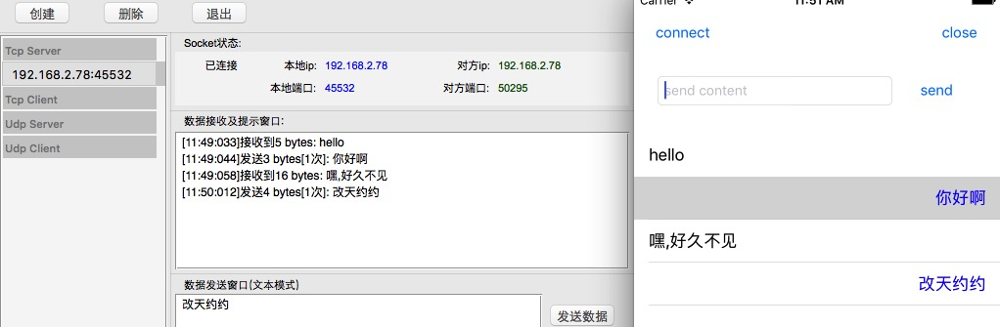

# JTSocket
#### socket connect
## Socket 是在应用层和传输层之间的一个抽象层，用于进程之间的通信。（具体网上很多科普，这里主要介绍怎么使用）
### Socket在客户端涉及到的操作主要有：1.创建Socket －>2.连接（connect）－>3.通讯消息（send）－>4.关闭（close）.
#### 使用方法：
#### 1.初始化
  ```Object-C
    NSString * host = @"192.168.2.78"; //可以用SocketTool创建,http://www.cocoachina.com/bbs/read.php?tid=141721
    NSNumber * port = @45532; //可以用SocketTool创建（创建的时候只要填端口号，ip会自动生成本机ip,推荐端口号大于6000）
    
    self.mySockt = [[JTSocket alloc] initWithHost:host port:port];
    if (self.mySockt == nil) {
        NSLog(@"init Socket -- fail");
    }
    self.mySockt.delegate = self;
  ```
#### 2.连接
```
[self.mySockt connect]
```
#### 3.发送消息与监听
```
//发送
[self.mySockt sendMessage:msgStr];
//监听代理
- (void)socket:(JTMessage *)message handleEvent:(JTSocketEvent)eventCode;
```
#### 4.关闭连接
```
[self.mySockt close];
```
测试：推荐使用SocketTool(http://www.cocoachina.com/bbs/read.php?tid=141721)，可以在本机模拟进行Socket通讯

